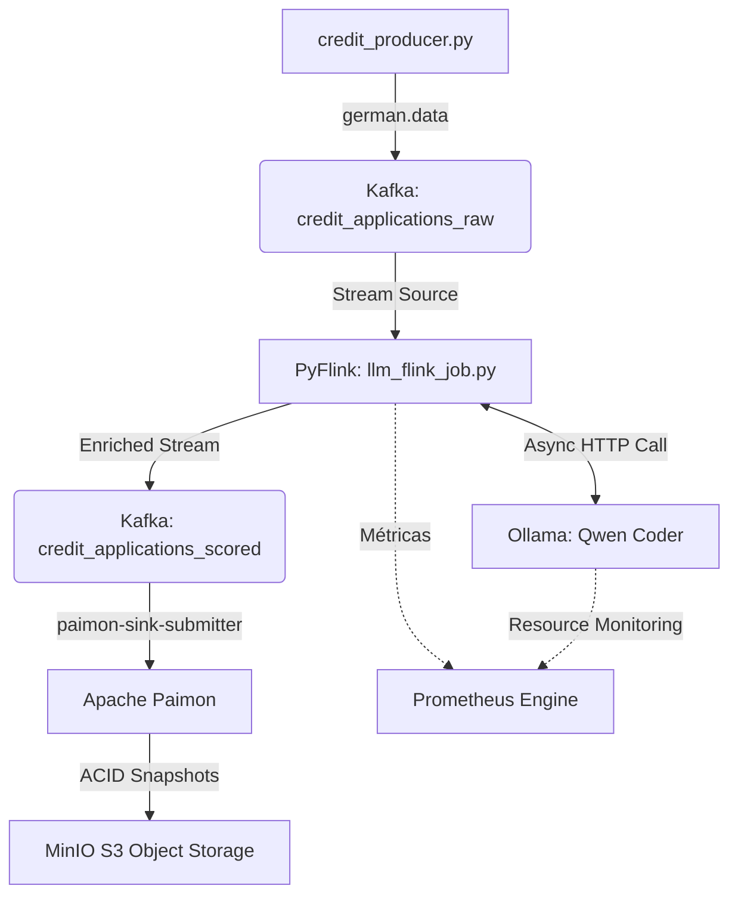

# Finstream 🚀

**Pipeline de Inteligência de Crédito em Tempo Real com PyFlink, Local LLMs (Ollama) e Arquitetura Lakehouse.**

O **Finstream** é uma plataforma de engenharia de dados em streaming desenvolvida para a ingestão, enriquecimento cognitivo assíncrono e classificação de risco de crédito bancário. O projeto simula a esteira de análise de um banco utilizando dados reais do **German Credit Data**, orquestrando LLMs de código aberto localmente sem bloquear o throughput da aplicação de mensageria.

O grande diferencial do projeto está no uso de **I/O Assíncrono (AsyncDataStream)** no Flink, permitindo que o pipeline consulte um modelo de linguagem local (como o **qwen2.5-coder**) via requisições HTTP sem travar os slots de computação do cluster distribuído.

---

# 🏗️ Arquitetura do Sistema

A arquitetura separa de forma reativa a camada de geração de eventos, inferência cognitiva com LLM, auditoria transacional em tabelas Lakehouse e observabilidade em tempo real.



---

# ✨ Funcionalidades Atuais

## 🧠 Inferência de LLM Assíncrona e Resiliente

- **Orquestração via AsyncFunction:** chamadas não bloqueantes para o motor local do Ollama utilizando `aiohttp` e controle estrito de concorrência (`capacity`) para evitar o estrangulamento do hardware executando em CPU.

- **Engenharia de Prompt Estruturada:** prompt parametrizado que força o modelo a responder estritamente em formato JSON válido, contendo:
  - `predicao` (`1` para Baixo Risco, `2` para Alto Risco);
  - `justificativa`.

- **Tratamento Automático de Falhas:** captura dinâmica de exceções (como `TimeoutError`), higienização de respostas inesperadas e geração de fallbacks seguros para evitar a queda do cluster Flink.

## 🏞️ Arquitetura Lakehouse (Paimon + MinIO)

- **Snapshots Transacionais:** consumo do tópico final pelo Flink SQL (`paimon-sink-submitter`) e escrita contínua no Apache Paimon armazenado no MinIO.

- **Time Travel Integrado:** capacidade de auditar e retroceder o estado das tabelas analíticas através dos commits automáticos gerados a cada intervalo de checkpoint do Flink.

## 📊 Observabilidade de Streaming (Prometheus)

Coleta e exposição de métricas como:

- Consumer Lag do Kafka;
- tamanho da fila de requisições pendentes do operador assíncrono (`queueSize`);
- Heap Memory;
- CPU Load;
- métricas da JVM para monitoramento de gargalos.

---

# 🛠️ Stack Tecnológica

| Categoria              | Tecnologia                                  |
| ---------------------- | ------------------------------------------- |
| Linguagem Base         | Python 3.12+ (gerenciado via `uv`)          |
| Processamento Stream   | Apache Flink 2.2 / PyFlink                  |
| Modelos de Linguagem   | Ollama (`qwen2.5-coder:3b` / `qwen2.5:3b`)  |
| Message Broker         | Apache Kafka 4.3.1                          |
| Lakehouse Storage      | Apache Paimon 1.4.2 + MinIO (S3 API)        |
| Ecossistema de Análise | JupyterLab (`pypaimon` + `duckdb`)          |
| Monitoramento          | Prometheus Server (JMX/Prometheus Reporter) |
| Orquestração           | Docker, Docker Compose e Makefile           |

---

# 📁 Estrutura do Projeto

```text
finstream/
├── processors/
│   └── llm_flink_job.py          # Script principal do PyFlink
│
├── producers/
│   ├── credit_producer.py        # Produtor contínuo do dataset
│   └── german.data               # Dataset German Credit
│
├── sql/
│   ├── init_catalog.sql          # Inicialização do catálogo Paimon
│   └── scored_to_paimon.sql      # Pipeline Kafka → Paimon
│
├── docker/
│   └── flink/
│       └── Dockerfile            # Flink customizado com conectores
│
├── prometheus/
│   └── prometheus.yml            # Configuração do Prometheus
│
├── .env                          # Configuração do modelo LLM
├── docker-compose.yaml           # Infraestrutura completa
└── Makefile                      # Comandos auxiliares
```

---

# 🚀 Executando o Ambiente

## 1. Configure o modelo LLM

Crie um arquivo `.env` na raiz do projeto:

```env
OLLAMA_MODEL=qwen2.5-coder:3b
```

---

## 2. Inicialize a infraestrutura

```bash
# Compila e sobe toda a infraestrutura
make

# Verifica os containers
make ps
```

> **Nota:** o container `ollama-pull` aguarda a inicialização do Ollama, faz automaticamente o download do modelo especificado no `.env` e somente depois libera a submissão do job do Flink.

---

# 🔍 Validação e Consulta dos Dados

# 🔍 Validação e Inspeção dos Dados

## Flink Web UI

Acompanhe a execução do pipeline e o processamento em tempo real através da interface do Flink:

```
http://localhost:8081
```

---

## Análise dos Dados no Lakehouse

Após o pipeline processar as aplicações de crédito, acesse o **JupyterLab** para explorar os dados armazenados no Apache Paimon utilizando DuckDB.

Abra no navegador:

```
http://0.0.0.0:8888
```

Em seguida, execute o notebook:

```
inspection.ipynb
```

O notebook já está configurado para conectar ao Lakehouse e permite:

- Consultar os dados armazenados no Apache Paimon;
- Explorar as predições geradas pelo LLM;
- Comparar a classificação prevista com o target real;
- Realizar análises exploratórias utilizando DuckDB.

---

# 📦 Exemplo de Payload

```json
{
  "id_cliente": 42,
  "target_real": 2,
  "predicao": 2,
  "justificativa": "Saldo em conta corrente negativo e histórico com atrasos passados superam o bom propósito do empréstimo, elevando o risco de inadimplência.",
  "modelo": "qwen2.5-coder:3b"
}
```

---

# 📊 Métricas no Prometheus

Interface Web:

```
http://localhost:9090
```

Consultas úteis:

### Tamanho da fila assíncrona

```text
{__name__=~".*queueSize.*"}
```

ou

```text
flink_taskmanager_job_task_operator_AvaliacaoCreditoLLM_queueSize
```

---

### Kafka Consumer Lag

```text
flink_taskmanager_job_task_operator_KafkaSourceReader_KafkaConsumer_records_lag_max
```

---

### Uso de Heap da JVM

```text
flink_taskmanager_Status_JVM_Memory_Heap_Used
```

---

# 🛡️ Licença

Este projeto está licenciado sob a **MIT License**.

Consulte o arquivo **LICENSE** para mais informações.
