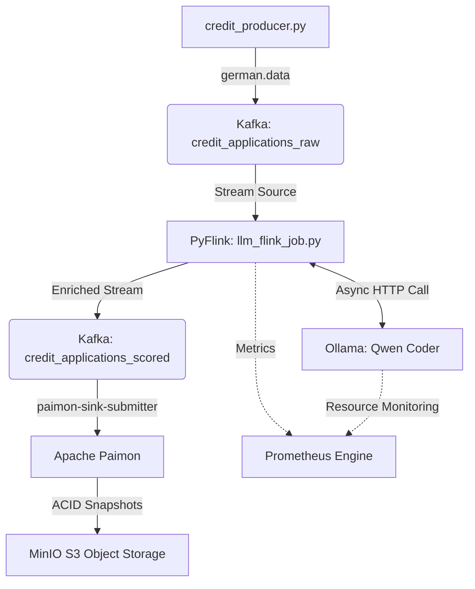
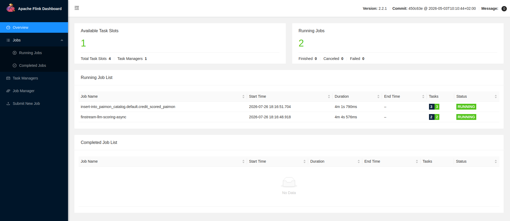
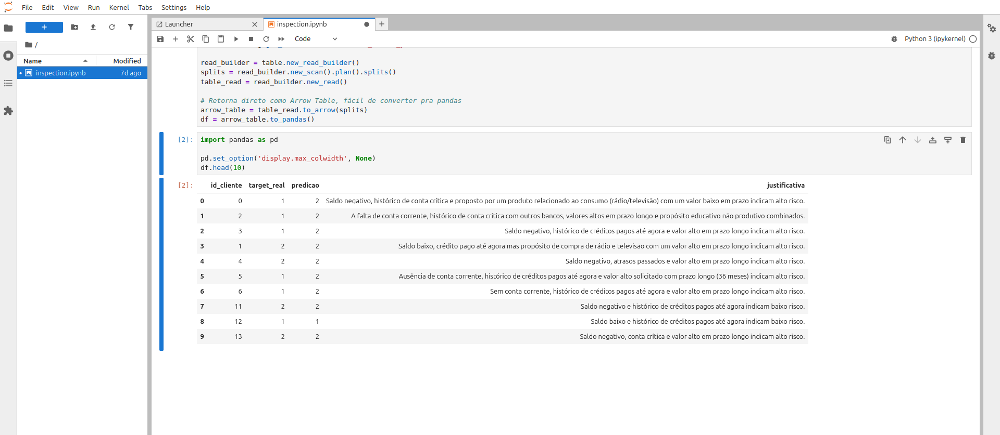
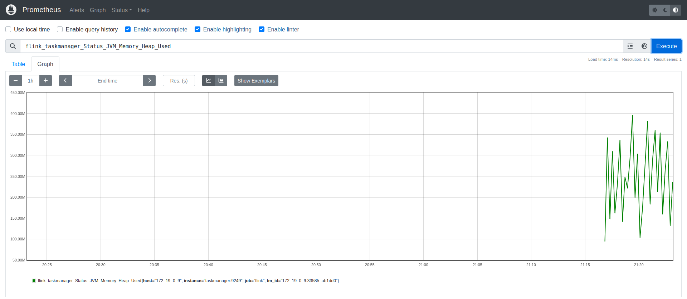
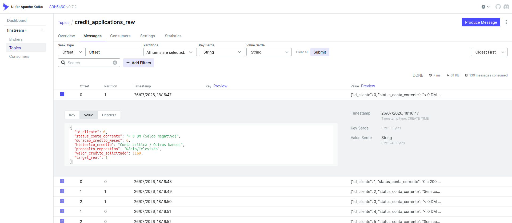
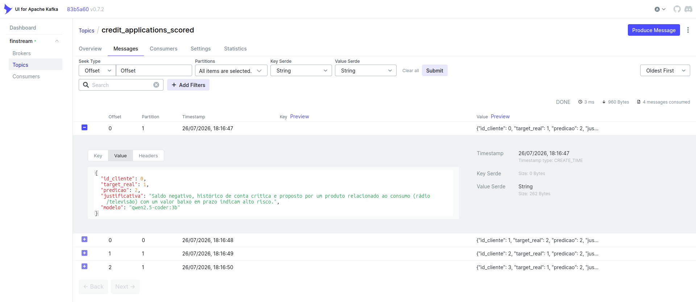

# Finstream 🚀

[](https://www.python.org/)
[](https://flink.apache.org/)
[](https://kafka.apache.org/)
[](https://paimon.apache.org/)
[](https://ollama.com/)
[](https://www.docker.com/)
[](https://prometheus.io/)
[](LICENSE)


**Real-Time Credit Intelligence Pipeline with PyFlink, Local LLMs (Ollama), and Lakehouse Architecture.**

**Finstream** is a streaming data engineering platform built for the ingestion, asynchronous cognitive enrichment, and risk classification of bank credit applications. The project simulates a bank's underwriting pipeline using real-world **German Credit Data**, orchestrating open-source LLMs locally without blocking the throughput of the messaging layer.

The project's key differentiator is the use of **Asynchronous I/O (`AsyncDataStream`)** in Flink, allowing the pipeline to query a local language model (such as **qwen2.5-coder**) over HTTP without stalling the compute slots of the distributed cluster.

---

## 📑 Table of Contents

- [Architecture](#️-system-architecture)
- [Features](#-current-features)
- [Tech Stack](#️-tech-stack)
- [Project Structure](#-project-structure)
- [Getting Started](#-getting-started)
- [Data Validation & Exploration](#-data-validation--exploration)
- [Monitoring with Prometheus](#-monitoring-with-prometheus)
- [Sample Payload](#-sample-payload)
- [License](#️-license)

---

## 🏗️ System Architecture

The architecture reactively separates event generation, LLM-based cognitive inference, transactional auditing in Lakehouse tables, and real-time observability.



---

## ✨ Current Features

### 🧠 Asynchronous & Resilient LLM Inference

- **Orchestration via `AsyncFunction`:** non-blocking calls to the local Ollama engine using `aiohttp`, with strict concurrency control (`capacity`) to prevent hardware bottlenecks when running on CPU.
- **Structured Prompt Engineering:** a parameterized prompt that forces the model to reply strictly in valid JSON, containing:
  - `predicao` (`1` = Low Risk, `2` = High Risk);
  - `justificativa` (the model's reasoning).
- **Automatic Failure Handling:** dynamic exception capture (e.g. `TimeoutError`), sanitization of unexpected responses, and safe fallbacks to prevent the Flink cluster from crashing.

### 🏞️ Lakehouse Architecture (Paimon + MinIO)

- **Transactional Snapshots:** the final topic is consumed by Flink SQL (`paimon-sink-submitter`) and continuously written to Apache Paimon, backed by MinIO.
- **Built-in Time Travel:** ability to audit and roll back the state of analytical tables through automatic commits generated at each Flink checkpoint interval.

### 📊 Streaming Observability (Prometheus)

Collection and exposure of metrics such as:

- Kafka consumer lag;
- pending request queue size for the async operator (`queueSize`);
- heap memory usage;
- CPU load;
- JVM metrics for bottleneck monitoring.

---

## 🛠️ Tech Stack

| Category               | Technology                                   |
| ----------------------- | --------------------------------------------- |
| Base Language            | Python 3.12+ (managed via `uv`)              |
| Stream Processing        | Apache Flink 2.2 / PyFlink                    |
| Language Models          | Ollama (`qwen2.5-coder:3b` / `qwen2.5:3b`)   |
| Message Broker           | Apache Kafka 4.3.1                            |
| Lakehouse Storage        | Apache Paimon 1.4.2 + MinIO (S3 API)          |
| Analytics Ecosystem      | JupyterLab (`pypaimon` + `duckdb`)           |
| Monitoring               | Prometheus Server (JMX/Prometheus Reporter)   |
| Orchestration            | Docker, Docker Compose, and Makefile          |

---

## 📁 Project Structure

```text
finstream/
├── processors/
│   └── llm_flink_job.py          # Main PyFlink script
│
├── producers/
│   ├── credit_producer.py        # Continuous dataset producer
│   └── german.data               # German Credit dataset
│
├── sql/
│   ├── init_catalog.sql          # Paimon catalog initialization
│   └── scored_to_paimon.sql      # Kafka → Paimon pipeline
│
├── docker/
│   └── flink/
│       └── Dockerfile            # Custom Flink image with connectors
│
├── prometheus/
│   └── prometheus.yml            # Prometheus configuration
│
├── .env                          # LLM model configuration
├── docker-compose.yaml           # Full infrastructure
└── Makefile                      # Helper commands
```

---

## 🚀 Getting Started

### 1. Configure the LLM model

Create a `.env` file at the project root:

```env
OLLAMA_MODEL=qwen2.5-coder:3b
```

### 2. Start the infrastructure

```bash
# Build and start the full infrastructure
make

# Check running containers
make ps
```

> **Note:** the `ollama-pull` container waits for Ollama to start, automatically downloads the model specified in `.env`, and only then releases the Flink job submission.

---

## 🔍 Data Validation & Exploration

### Flink Web UI

Track pipeline execution and real-time processing through the Flink dashboard:

```
http://localhost:8081
```

*Flink Dashboard showing the `finstream-llm-scoring-async` and Paimon sink jobs running.*



### Lakehouse Data Exploration

Once the pipeline has processed the credit applications, open **JupyterLab** to explore the data stored in Apache Paimon using DuckDB and pandas:

```
http://0.0.0.0:8888
```

Then run the notebook:

```
inspection.ipynb
```

The notebook is pre-configured to connect to the Lakehouse and lets you:

- Query the data stored in Apache Paimon;
- Explore the predictions generated by the LLM;
- Compare predicted classification against the real target;
- Run exploratory analysis with DuckDB and pandas.

*Querying the scored Paimon table with pandas inside JupyterLab — comparing `predicao` against `target_real`, with the LLM's `justificativa` for each application.*



---

## 📊 Monitoring with Prometheus

Web interface:

```
http://localhost:9090
```

*Prometheus graph view showing `flink_taskmanager_Status_JVM_Memory_Heap_Used` over time.*



Useful queries:

**Async queue size**

```text
{__name__=~".*queueSize.*"}
```

or

```text
flink_taskmanager_job_task_operator_AvaliacaoCreditoLLM_queueSize
```

**Kafka consumer lag**

```text
flink_taskmanager_job_task_operator_KafkaSourceReader_KafkaConsumer_records_lag_max
```

**JVM heap usage**

```text
flink_taskmanager_Status_JVM_Memory_Heap_Used
```

### Kafka UI

Inspect topics, partitions, and messages flowing through the pipeline:

```
http://localhost:8080
```

*Kafka UI — `credit_applications_raw` topic, with the semantically-translated payload produced from `german.data`.*



*Kafka UI — `credit_applications_scored` topic, with the LLM's `predicao` and `justificativa` already attached to each message.*



---

## 📦 Sample Payload

```json
{
  "id_cliente": 42,
  "target_real": 2,
  "predicao": 2,
  "justificativa": "Negative checking account balance and a history of past delays outweigh the good loan purpose, increasing default risk.",
  "modelo": "qwen2.5-coder:3b"
}
```

---

## 🛡️ License

This project is licensed under the **MIT License**.

See the **LICENSE** file for more information.
