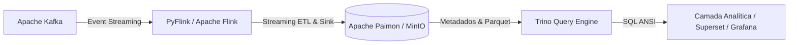

# Finstream 🚀

**Pipeline de Processamento de Dados Financeiros em Tempo Real com arquitetura Lakehouse.**

O **Finstream** é uma plataforma de engenharia de dados desenhada para a ingestão, processamento e detecção de fraudes em transações financeiras sob o paradigma de _streaming_. O ecossistema combina a baixa latência do processamento em tempo real com os benefícios analíticos de um Data Lakehouse moderno, permitindo consultas históricas complexas e auditoria via **time travel**.

---

# 🏗️ Arquitetura do Sistema

A arquitetura desacopla completamente as camadas de ingestão, computação distribuída, metadados e consulta SQL.



---

# ✨ Funcionalidades

- **Processamento Stream End-to-End**
  - Ingestão contínua de eventos de transações financeiras simuladas via Apache Kafka.

- **Detecção de Fraude em Tempo Real**
  - Mecanismo de avaliação instantânea (_Streaming ETL_) implementado em PyFlink para classificar transações como `APPROVED` ou `FRAUD_SUSPECT` com base em regras de negócio dinâmicas.

- **Arquitetura Lakehouse Resiliente**
  - Armazenamento ACID utilizando Apache Paimon sobre S3 (MinIO Object Storage), formatado em arquivos Parquet compactados com Zstd.

- **Versionamento e Time Travel**
  - Capacidade nativa do Paimon para inspecionar snapshots históricos do estado da tabela a cada ciclo de checkpoint (60s).

- **Query Engine Distribuído**
  - Camada de serviço de dados alimentada pelo Trino, permitindo `JOIN`s, agregações e análises _ad hoc_ diretamente sobre as tabelas do Lakehouse sem impacto no pipeline de escrita.

---

# 🛠️ Stack Tecnológica

| Categoria                         | Tecnologia                                            |
| --------------------------------- | ----------------------------------------------------- |
| **Linguagem Core**                | Python 3.12+ (Ambiente isolado e gerenciado via `uv`) |
| **Motor de Processamento**        | PyFlink / Apache Flink                                |
| **Formato de Tabela (Lakehouse)** | Apache Paimon                                         |
| **Armazenamento de Objetos**      | MinIO (Compatível com S3)                             |
| **Motor de Consulta SQL**         | Trino (Trino Query Engine)                            |
| **Message Broker**                | Apache Kafka                                          |
| **Orquestração Local**            | Docker Compose                                        |

---

# 🚀 Como Executar o Ambiente

## Pré-requisitos

- Docker e Docker Compose instalados.
- Ferramenta `uv` para gerenciamento de dependências Python.
- Ficheiros JAR dos conectores necessários localizados na pasta `jars/`.

## 1. Clonar o repositório

```bash
git clone https://codeberg.org/seu-usuario/finstream.git
cd finstream
```

## 2. Subir os containers da stack

```bash
docker compose up -d
```

## 3. Iniciar o Job de Streaming (PyFlink)

```bash
uv run processors/fraud_detection.py
```

## 4. Inspecionar snapshots e dados processados

```bash
uv run inspect_paimon.py
```

---

# 📊 Integração com Trino Analytics

O catálogo do Paimon é exposto nativamente para o Trino através do mapeamento de volumes configurado em:

- `./trino/etc`
- `./trino/plugin/paimon/`

## Acessando a CLI do Trino

```bash
docker exec -it trino trino
```

Dentro da CLI, execute:

```sql
SHOW CATALOGS;

USE paimon;

SHOW TABLES IN default;

SELECT *
FROM default.processed_transactions$snapshots;
```

Qualquer ferramenta compatível com **JDBC/ODBC** (como **Apache Superset** ou **Grafana**) pode se conectar utilizando:

- **Endpoint:** `http://localhost:8080`
- **Catálogo:** `paimon`

---

# 🛣️ Roadmap de Evolução

- [ ] Acoplamento do Apache Superset para dashboards executivos de volumetria de fraude.
- [ ] Implementação de Complex Event Processing (CEP) no Flink para identificar fraudes por padrões comportamentais (ex.: múltiplas tentativas em janelas deslizantes de 5 minutos).
- [ ] Implementação de _sinks_ secundários para mensageria instantânea (alertas via Webhook no Discord/Telegram).

---

# 🛡️ Licença

Este projeto está sob a licença **MIT**.

Consulte o arquivo `LICENSE` para mais detalhes.
