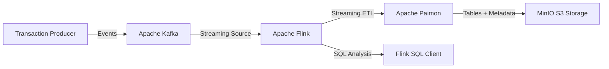

# Finstream 🚀

**Pipeline de Processamento de Dados Financeiros em Tempo Real com arquitetura Lakehouse.**

O **Finstream** é uma plataforma de engenharia de dados desenvolvida para ingestão, processamento e detecção de fraudes em transações financeiras utilizando arquitetura baseada em **stream processing**.

O projeto combina:

- baixa latência de processamento distribuído em tempo real;
- armazenamento transacional de um Data Lakehouse;
- versionamento e auditoria através de snapshots históricos.

A solução utiliza **Apache Flink** como motor de processamento, **Apache Paimon** como formato de tabela Lakehouse e **MinIO** como camada de armazenamento de objetos compatível com S3.

---

# 🏗️ Arquitetura do Sistema

A arquitetura desacopla completamente as camadas de ingestão, processamento, armazenamento e consulta SQL.



---

# ✨ Funcionalidades

## ⚡ Processamento Streaming End-to-End

- Geração de transações financeiras simuladas.
- Publicação contínua de eventos através do Apache Kafka.
- Processamento distribuído utilizando Apache Flink.

---

## 🔍 Detecção de Fraude em Tempo Real

O pipeline executa regras de negócio durante o processamento dos eventos.

As transações são classificadas como:

```
APPROVED
FRAUD_SUSPECT
```

O mecanismo permite evoluir para:

- regras temporais;
- análise comportamental;
- Complex Event Processing (CEP);
- integração com modelos de Machine Learning.

---

## 🏞️ Arquitetura Lakehouse

Os dados processados são armazenados utilizando Apache Paimon.

Características:

- tabelas transacionais;
- consistência ACID;
- snapshots históricos;
- compactação de arquivos;
- armazenamento baseado em objetos.

Arquitetura:

```
Apache Paimon
       |
       v
     MinIO
       |
       v
      S3 API
```

---

## 🕒 Time Travel e Auditoria

O Apache Paimon mantém histórico de alterações através de snapshots.

Isso permite:

- consultar estados anteriores;
- auditar alterações;
- recuperar versões específicas;
- acompanhar evolução das tabelas.

---

# 🛠️ Stack Tecnológica

| Categoria               | Tecnologia                 |
| ----------------------- | -------------------------- |
| Linguagem               | Python 3.12+               |
| Gerenciamento Python    | uv                         |
| Processamento Streaming | Apache Flink 2.2 / PyFlink |
| Formato Lakehouse       | Apache Paimon 1.4.2        |
| Object Storage          | MinIO                      |
| Message Broker          | Apache Kafka 4.3.1         |
| SQL Engine              | Flink SQL Client           |
| Gerenciamento JVM       | Maven                      |
| Containerização         | Docker                     |
| Orquestração            | Docker Compose             |

---

# 📦 Gerenciamento de Dependências Flink

As bibliotecas do ecossistema Flink são gerenciadas através do Maven.

O projeto não mantém uma pasta de JARs manualmente. O arquivo:

```
pom.xml
```

é responsável por definir os conectores e bibliotecas necessárias.

Principais dependências:

- Apache Paimon para Flink 2.2;
- Paimon S3 para integração com MinIO;
- Kafka SQL Connector;
- dependências transitivas Hadoop e AWS SDK.

Exemplo:

```xml
<dependency>
    <groupId>org.apache.paimon</groupId>
    <artifactId>paimon-flink-2.2</artifactId>
    <version>1.4.2</version>
</dependency>
```

Durante o build:

```bash
mvn package
```

o Maven resolve automaticamente as dependências e gera:

```
target/flink-lib/
```

Essa pasta contém as bibliotecas utilizadas para construir a imagem personalizada do Flink.

---

# 📁 Estrutura do Projeto

```
finstream/

├── processors/
│   └── fraud_detection.py
│
├── producers/
│   └── generate_transactions.py
│
├── pom.xml
│
├── docker/flink/Dockerfile
│
├── docker-compose.yaml
│
├── Makefile
│
└── target/
    └── flink-lib/
```

---

# 🚀 Executando o Ambiente

## Pré-requisitos

Instale:

- Docker;
- Docker Compose;
- Java 21+;
- Maven 3.9+;
- Python 3.12+;
- uv.

---

# ⚙️ Build Completo

O projeto utiliza um `Makefile` para automatizar o fluxo completo.

Executar:

```bash
make
```

ou:

```bash
make all
```

Fluxo:

```
Maven
  |
  v
Dependências Flink
  |
  v
Docker Image
  |
  v
Docker Compose
```

---

# 🔨 Build Maven

Gerar as bibliotecas do runtime:

```bash
make build-mvn
```

Resultado:

```
target/flink-lib/
```

---

# 🐳 Build Docker

Construir a imagem personalizada:

```bash
make build-docker
```

---

# 🚀 Subir Infraestrutura

```bash
make up
```

Serviços iniciados:

- Apache Kafka;
- Flink JobManager;
- Flink TaskManager;
- Flink SQL Client;
- MinIO;
- Prometheus.

Web UI do Flink:

```
http://localhost:8081
```

---

# 🧪 Execução do Pipeline

Após iniciar a infraestrutura com:

```bash
docker compose up -d
```

o pipeline é iniciado automaticamente pelos containers, incluindo:

- **Producer**: gera continuamente transações financeiras simuladas.
- **Processor (PyFlink)**: consome os eventos do Kafka, aplica as regras de detecção de fraude e grava os resultados no Apache Paimon.

Não é necessário executar manualmente:

```bash
uv run producers/generate_transactions.py
```

ou

```bash
uv run processors/fraud_detection.py
```

Esses processos já fazem parte da infraestrutura definida no `docker-compose.yaml`.

---

# SQL Client

Acessar o SQL Client:

```bash
docker exec -it flink-sql-client \
/opt/flink/bin/sql-client.sh
```

Criar catálogo Paimon:

```sql
CREATE CATALOG IF NOT EXISTS paimon_catalog WITH (
    'type' = 'paimon',
    'warehouse' = 's3://warehouse/paimon',
    's3.endpoint' = 'http://minio:9000',
    's3.path-style-access' = 'true',
    's3.access-key' = 'admin',
    's3.secret-key' = 'password',
    's3.region' = 'us-east-1'
);
```

Selecionar catálogo:

```sql
USE CATALOG paimon_catalog;
```

Listar tabelas:

```sql
SHOW TABLES;
```

Consultar dados:

```sql
SELECT *
FROM processed_transactions;
```

---

# 📊 Operação via Makefile

## Status dos serviços

```bash
make ps
```

## Logs gerais

```bash
make logs
```

## Logs SQL Client

```bash
make logs-sql
```

## Listar Jobs Flink

```bash
make flink-list
```

## Parar serviços

```bash
make stop
```

## Derrubar containers

```bash
make down
```

## Recriar ambiente

```bash
make reset
```

---

# 🛣️ Roadmap

- [ ] Dashboards executivos utilizando Apache Superset.
- [ ] Implementação de Complex Event Processing (CEP).
- [ ] Integração com modelos de Machine Learning.
- [ ] Alertas em tempo real via Webhook.
- [ ] Deploy em Kubernetes utilizando Flink Kubernetes Operator.
- [ ] Pipeline CI/CD para publicação automática da imagem Flink.

---

# 🛡️ Licença

Este projeto está licenciado sob MIT License.

Consulte o arquivo `LICENSE` para mais detalhes.
